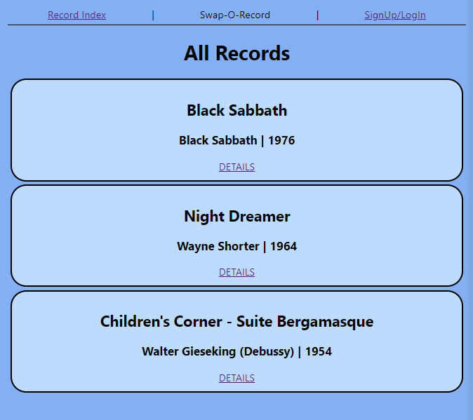
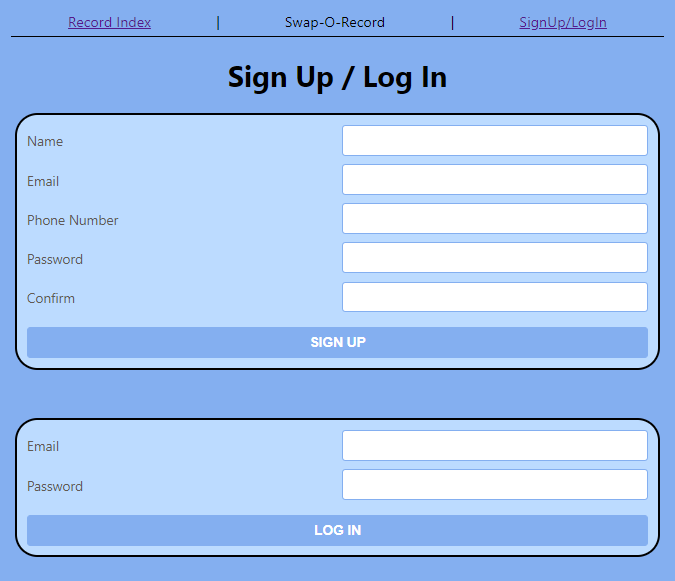
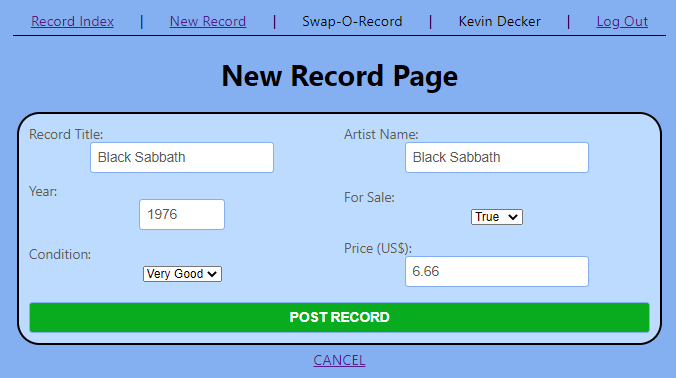
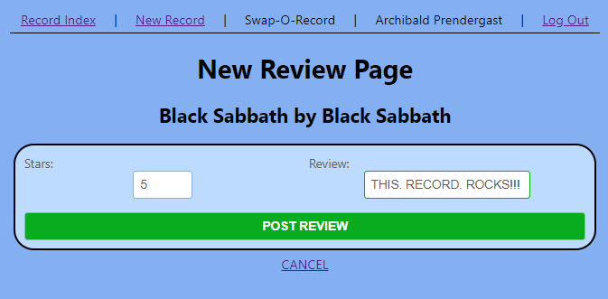
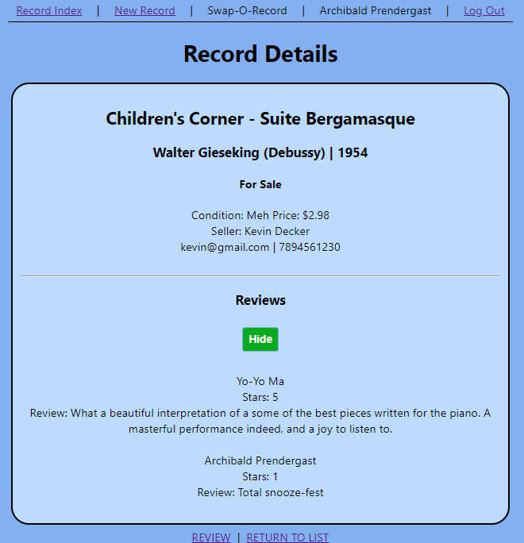
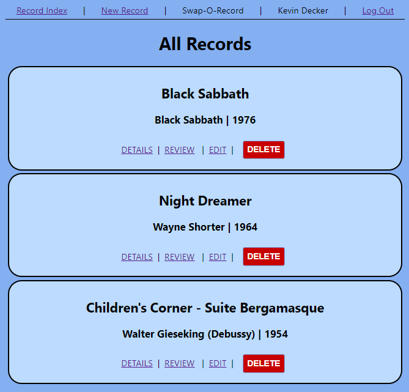

# Swap-O-Record

## Description

Swap-O-record is a marketplace and review board for vinyl records.  Have record you want to sell, go ahead and post it.  Have an opinion on a record that is for sale, go ahead and leave a review.  It might just help make somebody decide if they should buy it or not.  Not looking to sell, but got a record in your collection that you want to brag about, that's cool too.

---

## In Action

- Any body can browse the records and see the reviews.

- But if you want to post your own records or leave reviews you will need to sign up.

- Now you can post records fo your own.

- Or review records that are for sale.

- An interactive community can really help when making the decision, "To buy, or not to buy?" (Did you know that Shakespeare came up with that line from Hamlet while he was pondering whether or not to add another record to his collection?).

- You can delete any record that you have posted, either when it is sold or if you decide you cannot part with it after all.

---

## Technologies Used

Swap-O-Record is made in the MERN full-stack:

Mongoose/MongoDB, Express, React, Node.js

---

## Check it out

[Click here](https://swap-o-record.herokuapp.com/) to check it out and join the community.

Take a look at the progress of future plans [here](https://trello.com/b/4a0dc0x7/swap-o-record).

---

## Next Steps

Future advancements I plan on making include:

1. Allow users to upload images of the records they are posting.
2. Consume a 3rd party API to allow for previewing records before purchasing.
3. Create sorting functionality for easier browsing of posted records.